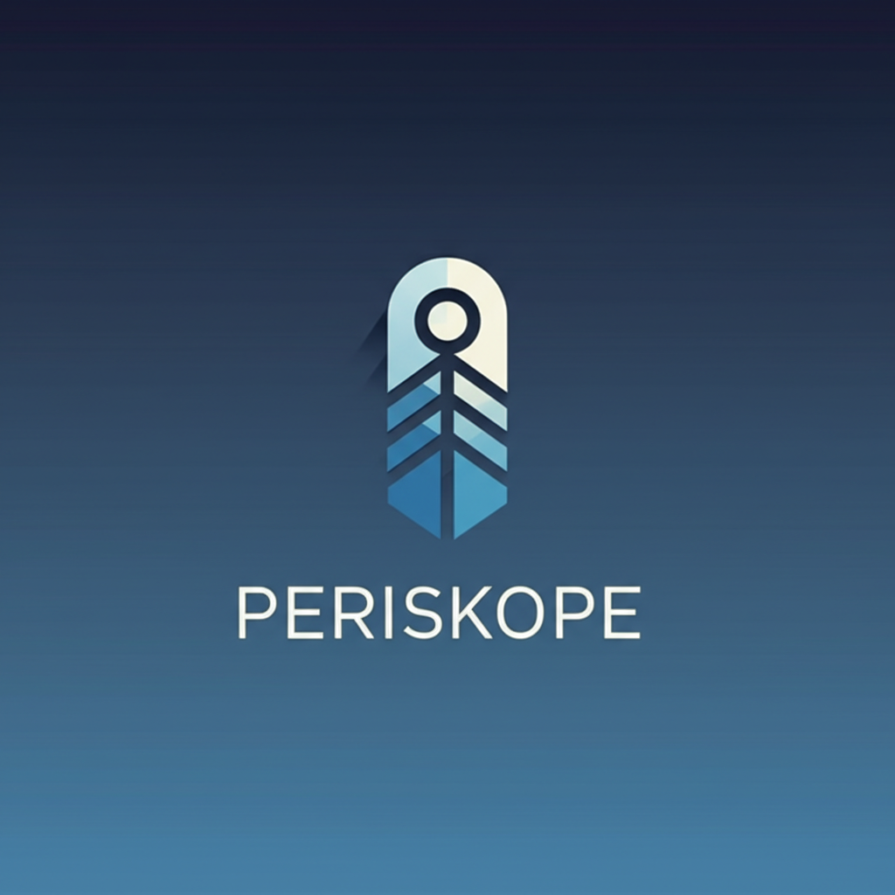

# Periskope Chat



A multi-user, multi-number WhatsApp inbox and automation platform built with Next.js, Tailwind CSS, and Supabase.

## Table of Contents

- [Overview](#overview)
- [Features](#features)
- [Technology Stack](#technology-stack)
- [Getting Started](#getting-started)
  - [Prerequisites](#prerequisites)
  - [Installation](#installation)
  - [Database Setup](#database-setup)
- [Usage](#usage)
- [Project Structure](#project-structure)
- [API Documentation](#api-documentation)
- [Deployment](#deployment)
- [Contributing](#contributing)
- [License](#license)

## Overview

Periskope Chat is a real-time messaging platform designed to provide a multi-user, multi-number WhatsApp inbox experience. It allows teams to collaborate on customer conversations, assign conversations to team members, add labels, and more.

## Features

- **Authentication**
  - User registration and login
  - Session management

- **Real-time Messaging**
  - Instant message delivery
  - Read receipts
  - Typing indicators

- **Conversation Management**
  - Create individual and group conversations
  - Invite users to conversations
  - Search and filter conversations

- **User Interface**
  - Responsive design
  - Dark/light mode support
  - Message history with timestamps
  - User avatars and status indicators

- **Organization Features**
  - Conversation labels
  - Member assignment
  - Conversation filters

- **Optional Features**
  - File attachments (images, videos, documents)
  - Group chat functionality
  - Offline support with IndexedDB

## Technology Stack

- **Frontend**
  - Next.js 14 (App Router)
  - TypeScript
  - Tailwind CSS
  - shadcn/ui components

- **Backend**
  - Supabase (PostgreSQL)
  - Supabase Auth
  - Supabase Realtime

- **Deployment**
  - Vercel

## Getting Started

### Prerequisites

- Node.js 18.x or higher
- npm or yarn
- Supabase account

### Installation

1. Clone the repository:

```bash
git clone https://github.com/devradheee/periskope-chat.git
cd periskope-chat
